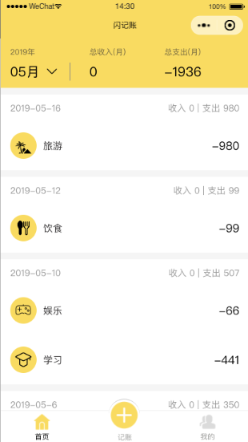
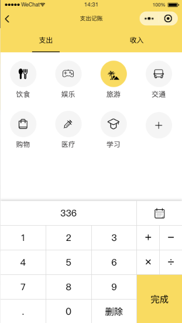
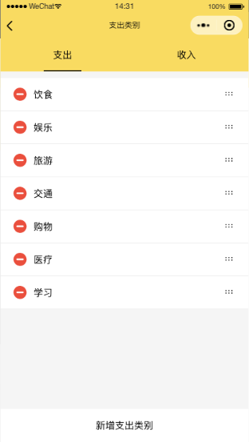
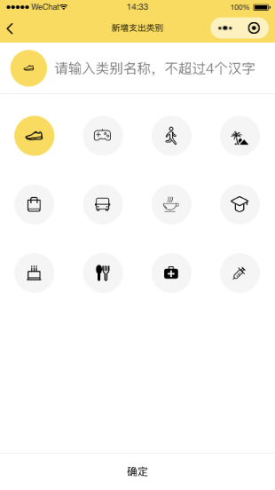

## 技术栈

> mpvue + vuex + koa2 + mongoose

## 线上版本


## 运行

### 运行前端

```shell
# 安装依赖
npm install

# 运行开发环境
npm run dev

# 用小程序开发工具导入dist下的项目
```

### 运行后端

```shell
# 进入server目录
cd server

# 安装依赖
npm install

# 运行开发环境
npm run dev
```

### 开启mongo

```shell
# 安装 
# 移步 https://www.runoob.com/mongodb/mongodb-window-install.html

# 开启
mongod
```

## 页面展示

 


 

